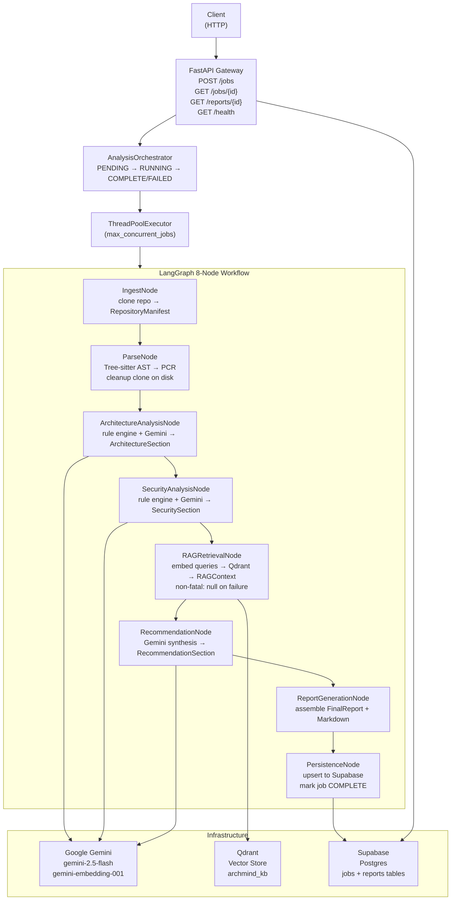

# ArchMind AI

AI-powered software architecture review agent. Submit a public GitHub repository URL and receive a structured report covering architecture pattern detection, security findings mapped to OWASP Top 10, and prioritised recommendations grounded in a curated knowledge base.

---

## Features

- **Automated architecture analysis** — detects patterns (Layered, MVC, Hexagonal, Service-Based, Monolith) with HIGH / MEDIUM / LOW confidence using deterministic rule engines and Gemini LLM narrative generation
- **Security findings** — static structural analysis for OWASP Top 10 2021 risk signals; severity assigned deterministically by rule engine, never by LLM
- **RAG-grounded recommendations** — retrieves relevant architecture and security guidance from a Qdrant knowledge base before synthesising P1/P2/P3 recommendations
- **Six-section report** — Executive Summary, Repository Overview, Architecture Assessment, Security Findings, Recommendations, Actionable Next Steps
- **Multi-language parsing** — Full Tree-sitter AST analysis for Python, JavaScript, TypeScript (including TSX/JSX), and Go. An additional 13 file extension types (Java, Ruby, Rust, C#, C/C++, Kotlin, Swift, Scala, PHP) are recognized and included in file discovery and signal extraction, but no AST grammar is available for them at parse time
- **Async job API** — submit a job, poll for status, retrieve report when complete
- **Production-hardened** — startup dependency probes, orphaned job recovery on restart, structured JSON logging, configurable concurrency

---

## Architecture Overview



### Design principles

- **Single-process**: the FastAPI server and LangGraph workflow run in the same process. No message queue, no worker processes. `ThreadPoolExecutor` handles concurrent jobs.
- **State isolation**: each job runs in its own `AnalysisState` TypedDict. Nodes own exactly one output field; no node overwrites another node's field.
- **Deterministic classification, LLM narrative**: rule engines assign all severity/confidence/priority values. LLM generates human-readable text only.
- **RAG is non-fatal**: if Qdrant is unreachable or the collection is missing, `RAGRetrievalNode` sets `rag_context=None` and the workflow continues without grounding.

---

## Technology Stack

| Layer | Technology | Version |
|---|---|---|
| Web framework | FastAPI | 0.138.0 |
| ASGI server | Uvicorn | 0.49.0 |
| Data validation | Pydantic v2 | 2.13.4 |
| Settings | pydantic-settings | 2.14.1 |
| LLM + embeddings | Google Gemini (google-genai) | 2.8.0 |
| Workflow orchestration | LangGraph | 1.2.6 |
| Vector store | Qdrant | 1.18.0 |
| Database | Supabase (PostgreSQL) | 2.31.0 |
| AST parsing | Tree-sitter | 0.25.2 |
| Git cloning | GitPython | 3.1.50 |
| Test runner | pytest | 9.1.1 |

Default models: `gemini-2.5-flash` (generation), `models/gemini-embedding-001` (embeddings, 3072-dim vectors).

---

## Project Structure

```
AI_Software_Architecture_Review_Agent/
├── .env.example                     # Environment variable template
├── requirements.txt                 # Production dependencies
├── requirements-dev.txt             # Test/dev dependencies
└── backend/
    ├── api/
    │   ├── main.py                  # FastAPI factory: create_app(), lifespan()
    │   ├── dependencies.py          # Singleton providers: get_supabase_client(), get_orchestrator()
    │   ├── routers/
    │   │   ├── health.py            # GET /health
    │   │   ├── jobs.py              # POST /jobs, GET /jobs, GET /jobs/{id}
    │   │   └── reports.py           # GET /reports/{id}
    │   └── schemas/
    │       ├── health_schemas.py    # HealthResponse, DependencyStatus
    │       ├── job_schemas.py       # SubmitJobRequest, JobSubmittedResponse, JobStatusResponse
    │       └── report_schemas.py    # ReportResponse, ReportSectionResponse, ReportMetadataResponse
    ├── config/
    │   ├── settings.py              # Settings (pydantic-settings), get_settings()
    │   └── constants.py             # Thresholds, limits, report schema version
    ├── core/
    │   └── workflow/
    │       ├── graph.py             # LangGraph StateGraph, get_compiled_graph()
    │       ├── nodes/               # One file per node (8 nodes)
    │       └── state/
    │           └── analysis_state.py  # AnalysisState TypedDict, helper functions
    ├── infrastructure/
    │   ├── gemini_client.py         # GeminiClient: generate(), embed(), probe()
    │   ├── qdrant_client.py         # QdrantClient: search(), upsert_points(), collection_exists()
    │   └── supabase_client.py       # SupabaseClient: insert_job(), get_job(), get_report(), recover_orphaned_jobs()
    ├── knowledge_base/
    │   ├── architecture/            # Markdown documents: layered architecture, microservices patterns
    │   └── security/                # Markdown documents: OWASP Top 10, injection prevention
    ├── rag/
    │   ├── chunker.py               # chunk_document(): header-split + fixed-window with overlap
    │   └── loader.py                # KnowledgeBaseLoader: embed + upsert to Qdrant
    ├── scripts/
    │   ├── load_knowledge_base.py   # CLI: load KB markdown into Qdrant
    │   └── validate_gemini.py       # CLI: smoke-test Gemini API key
    ├── services/
    │   ├── architecture_agent/      # ArchitectureService: rule_engine + prompt_builder
    │   ├── ingestion/               # IngestionService: clone + manifest_builder
    │   ├── orchestrator/            # AnalysisOrchestrator: job lifecycle management
    │   ├── parser/                  # ParserService: file_parser + signal extractors + pcr_builder
    │   ├── persistence/             # PersistenceService: insert_report, update_job
    │   ├── rag_agent/               # RAGRetrievalService, query_builder
    │   ├── recommendation_agent/    # RecommendationService: rule_engine + prompt_builder
    │   ├── report_assembly/         # ReportService: section_builders + metadata_builder
    │   └── security_agent/          # SecurityService: rule_engine + prompt_builder
    ├── shared/
    │   ├── exceptions/              # Domain exception hierarchy (one file per domain)
    │   ├── logging/                 # Structured JSON logger (configure_logging, get_logger)
    │   └── types/                   # All data contracts (analysis_types, enums, job_types, ...)
    └── tests/                       # 385+ unit + integration tests
```

---

## How It Works

### Job lifecycle

```
POST /api/v1/jobs  { "repo_url": "https://github.com/owner/repo" }
    → 202 Accepted  { "job_id": "...", "status": "PENDING" }

GET /api/v1/jobs/{job_id}
    → { "status": "RUNNING" }   (while workflow executes)
    → { "status": "COMPLETE", "report_id": "..." }  (on success)
    → { "status": "FAILED", "error_message": "..." }  (on failure)

GET /api/v1/reports/{report_id}
    → Full report with 6 sections, metadata, and markdown content
```

### Workflow execution (per job)

1. **IngestNode** — validates the GitHub URL, clones the repository with a shallow fetch (`depth=1`) and a 120-second hard timeout, validates size (<200 MB) and commit history, builds a `RepositoryManifest` listing all source files
2. **ParseNode** — runs Tree-sitter AST parsing on up to 500 source files (skips files >1 MB), extracts cross-file coupling signals, architecture signals, security signals, and quality signals into a `ParsedCodeRepresentation`; deletes the clone from disk
3. **ArchitectureAnalysisNode** — deterministic rule engine classifies the architecture pattern and identifies structural weaknesses; Gemini generates narrative descriptions
4. **SecurityAnalysisNode** — deterministic rule engine maps structural patterns to OWASP Top 10 findings with severity (CRITICAL/HIGH/MEDIUM/LOW/INFO); Gemini generates per-finding descriptions; disclaimer text is structurally enforced
5. **RAGRetrievalNode** — builds typed semantic queries from architecture weaknesses and security findings, embeds them with `gemini-embedding-001`, retrieves the top-5 relevant chunks from Qdrant (cosine similarity ≥ 0.72, domain-filtered); non-fatal on any failure
6. **RecommendationNode** — Gemini synthesises P1/P2/P3 recommendations grounded in retrieved RAG chunks (maximum 15 recommendations, 3–10 actionable next steps)
7. **ReportGenerationNode** — assembles all agent outputs into a `FinalReport` with full Markdown content and structured metadata
8. **PersistenceNode** — upserts the report to Supabase, marks the job `COMPLETE`; insert failure is fatal after retries; update_job failure is non-fatal

---

## AI Agents

### Architecture Agent (`services/architecture_agent/`)

Detects one of five architecture patterns:

| Pattern | Description |
|---|---|
| `LAYERED` | Clear horizontal layers (presentation, business logic, data) |
| `MVC` | Model-View-Controller separation |
| `HEXAGONAL` | Ports-and-adapters / clean architecture |
| `SERVICE_BASED` | Coarse-grained services with a shared database |
| `MONOLITH_UNDIFFERENTIATED` | No discernible pattern |

Identifies structural weaknesses (high coupling, low cohesion, missing layers) and assigns HIGH / MEDIUM / LOW confidence based on the number of corroborating signals.

### Security Agent (`services/security_agent/`)

Detects six structural risk signal categories mapped to OWASP Top 10 2021:

| Signal | OWASP | Severity |
|---|---|---|
| Hardcoded secrets (passwords, API keys, tokens) | A02 Cryptographic Failures | HIGH |
| SQL construction patterns near DB calls | A03 Injection | HIGH |
| Authentication control gaps (missing guards, unconditional access) | A07 Authentication Failures | HIGH |
| Missing input validation at function entry points | A03 Injection | MEDIUM |
| Insecure default configurations (debug flags, permissive CORS-like patterns) | A05 Security Misconfiguration | MEDIUM |
| Missing error handling in security-critical code paths | A09 Logging & Monitoring Failures | LOW |

All severity assignments are deterministic. The LLM generates narrative only. `is_confirmed_vulnerability` is always `False` (static analysis, not confirmed exploits). Every report section carries a fixed disclaimer.

### Recommendation Agent (`services/recommendation_agent/`)

Derives priority from source finding severity:
- **P1**: CRITICAL or HIGH severity findings
- **P2**: MEDIUM severity or significant architectural violations
- **P3**: LOW severity, quality improvements, non-blocking concerns

Uses RAG-retrieved chunks to ground recommendations in established patterns when available.

---

## RAG Pipeline

The knowledge base provides grounding for recommendations. It lives in `backend/knowledge_base/` and is indexed into Qdrant before first use.

### Knowledge base domains

| Directory | Domain | Content |
|---|---|---|
| `knowledge_base/architecture/` | `ARCHITECTURE` | Layered architecture best practices, microservices patterns |
| `knowledge_base/security/` | `SECURITY` | OWASP Top 10 guidance, injection prevention |

### Indexing pipeline

```
markdown files → chunk_document() → embed (gemini-embedding-001) → upsert to Qdrant
```

Chunking strategy:
1. Split on H1/H2/H3 headers
2. Apply fixed-window (1500 chars, 150 char overlap) for long sections
3. Filter chunks shorter than 100 characters
4. Assign deterministic UUID5 point IDs (idempotent re-loads)

### Retrieval

- Queries are typed by domain (`ARCHITECTURE` or `SECURITY`)
- Domain filter is applied at Qdrant search time (payload filter)
- Cosine similarity threshold: 0.72
- Top-K per query: 5 chunks
- Maximum queries per job: 10 (sorted by severity descending before truncation)
- Chunks are deduplicated by `chunk_id`; highest score is kept

### Loading the knowledge base

```bash
# From the project root
PYTHONPATH=backend python backend/scripts/load_knowledge_base.py

# Drop and recreate the collection (re-index from scratch)
PYTHONPATH=backend python backend/scripts/load_knowledge_base.py --recreate
```

---

## API Documentation

Interactive documentation is available at `http://localhost:8000/docs` when the server is running.

### Endpoints

#### `GET /api/v1/health`

Returns server and dependency status. Always HTTP 200 — degraded dependencies are informational, not fatal.

```json
{
  "status": "ok",
  "version": "1.0",
  "dependencies": {
    "gemini": "ok",
    "qdrant": "ok",
    "supabase": "ok"
  }
}
```

Dependency values: `"ok"` | `"failed"` | `"unreachable"` | `"collection_missing"` | `"unknown"`

#### `POST /api/v1/jobs`

Submit a new analysis job. Only public GitHub HTTPS URLs are accepted.

**Request:**
```json
{ "repo_url": "https://github.com/owner/repo" }
```

**Response (202):**
```json
{
  "job_id": "550e8400-e29b-41d4-a716-446655440000",
  "status": "PENDING",
  "message": "Analysis queued. Poll GET /jobs/{job_id} for status."
}
```

#### `GET /api/v1/jobs`

List all jobs. Optional `?status=PENDING|RUNNING|COMPLETE|FAILED` filter.

#### `GET /api/v1/jobs/{job_id}`

Poll job status.

```json
{
  "job_id": "550e8400-...",
  "repo_url": "https://github.com/owner/repo",
  "repo_name": "repo",
  "status": "COMPLETE",
  "created_at": "2026-06-24T10:00:00+00:00",
  "started_at": "2026-06-24T10:00:01+00:00",
  "completed_at": "2026-06-24T10:05:30+00:00",
  "report_id": "6ba7b810-...",
  "error_message": null,
  "error_type": null
}
```

#### `GET /api/v1/reports/{report_id}`

Retrieve a completed report.

```json
{
  "report_id": "6ba7b810-...",
  "job_id": "550e8400-...",
  "repo_url": "https://github.com/owner/repo",
  "repo_name": "repo",
  "generated_at": "2026-06-24T10:05:30+00:00",
  "schema_version": "1.0",
  "markdown_content": "# ArchMind AI Report\n\n...",
  "metadata": {
    "primary_language": "Python",
    "detected_architecture_pattern": "LAYERED",
    "architecture_confidence": "HIGH",
    "security_finding_count": 3,
    "finding_counts_by_severity": { "CRITICAL": 0, "HIGH": 1, "MEDIUM": 2, "LOW": 0, "INFO": 0 },
    "highest_severity_finding": "HIGH",
    "recommendation_count": 7,
    "p1_recommendation_count": 1,
    "rag_chunks_used_count": 4,
    "analysis_duration_seconds": 90,
    "total_files_analyzed": 42,
    "total_llm_tokens_used": 15000
  },
  "sections": [
    {
      "section_order": 1,
      "section_key": "EXECUTIVE_SUMMARY",
      "section_title": "Executive Summary",
      "content_markdown": "..."
    }
  ]
}
```

Report sections (in order): `EXECUTIVE_SUMMARY`, `REPOSITORY_OVERVIEW`, `ARCHITECTURE_ASSESSMENT`, `SECURITY_FINDINGS`, `RECOMMENDATIONS`, `ACTIONABLE_NEXT_STEPS`.

---

## Installation

### Prerequisites

- Python 3.11+
- A running [Qdrant](https://qdrant.tech/) instance (local Docker or Qdrant Cloud)
- A [Supabase](https://supabase.com/) project with the ArchMind schema deployed
- A Google Gemini API key ([AI Studio](https://aistudio.google.com/app/apikey))

### 1. Clone the repository

```bash
git clone https://github.com/arafat-ds/AI_Software_Architecture_Review_Agent-ArchMind.AI-.git
cd AI_Software_Architecture_Review_Agent-ArchMind.AI-
```

### 2. Install dependencies

```bash
pip install -r requirements.txt
```

### 3. Configure environment

```bash
cp .env.example .env
```

Edit `.env` and fill in the required values:

| Variable | Required | Description |
|---|---|---|
| `GEMINI_API_KEY` | Yes | Google Gemini API key |
| `SUPABASE_URL` | Yes | Supabase project URL (`https://...supabase.co`) |
| `SUPABASE_KEY` | Yes | Supabase service role key |
| `QDRANT_HOST` | No | Qdrant host (default: `localhost`) |
| `QDRANT_PORT` | No | Qdrant port (default: `6333`) |
| `QDRANT_COLLECTION_NAME` | No | Collection name (default: `archmind_kb`) |
| `GEMINI_MODEL` | No | Generation model (default: `gemini-2.5-flash`) |
| `MAX_CONCURRENT_JOBS` | No | Concurrent job limit (default: `4`, range: `1–32`) |
| `LOG_LEVEL` | No | Log verbosity (default: `INFO`) |

### 4. Start Qdrant

```bash
docker run -d --name qdrant -p 6333:6333 qdrant/qdrant:latest
```

### 5. Load the knowledge base

```bash
PYTHONPATH=backend python backend/scripts/load_knowledge_base.py
```

### 6. Deploy the Supabase schema

In the Supabase SQL Editor, run `backend/scripts/supabase_schema.sql` to create the `jobs` and `reports` tables.

### 7. Start the server

```bash
python -m uvicorn api.main:create_app --factory --port 8000 --app-dir backend
```

Or with debug logging:

```bash
LOG_LEVEL=DEBUG python -m uvicorn api.main:create_app --factory --port 8000 --app-dir backend --reload
```

The server performs connectivity probes for Gemini, Qdrant, and Supabase on startup. Check `GET /api/v1/health` to confirm all dependencies are reachable.

---

## Running Tests

```bash
# Install dev dependencies
pip install -r requirements-dev.txt

# Run all tests from the backend directory
cd backend && python -m pytest

# Run with verbose output
python -m pytest -v

# Run a specific test file
python -m pytest tests/test_api_schemas.py -v
```

Tests require no running services. All external calls (Gemini, Qdrant, Supabase, git) are mocked. The test suite uses FastAPI `TestClient` and `unittest.mock`.

Current test count: 385+

---

## Production Features

### Startup dependency probes

On every server start, `lifespan()` runs three connectivity probes:

- **Supabase** — `recover_orphaned_jobs()` doubles as the connectivity probe; marks any `RUNNING` jobs as `FAILED` with an error message indicating server restart
- **Gemini** — `models.get()` zero-token call validates the API key and generation model
- **Qdrant** — `collection_exists()` validates both reachability and collection presence; reports distinct statuses for "unreachable" vs "collection_missing"

Probe results are stored in `app.state` and exposed via `GET /health`. All probes are non-fatal — the server starts regardless of probe outcome.

### Orphaned job recovery

If the server restarts while jobs are `RUNNING`, those jobs are recovered on startup and marked `FAILED` with `error_message = "Job interrupted: server restarted while job was RUNNING."` Clients polling for status receive the `FAILED` state.

### Concurrency

Analysis jobs run in a `ThreadPoolExecutor` with `max_workers=MAX_CONCURRENT_JOBS`. The executor is shared across all requests and shut down cleanly on server exit via `lifespan()`.

### Structured logging

All log output is JSON-formatted with consistent fields (`job_id`, `error_type`, `elapsed_ms`, etc.). Configure with `LOG_LEVEL` in `.env`.

### Error handling

- Fatal node errors (`FatalNodeError`) terminate the workflow and mark the job `FAILED`
- RAG retrieval failures are non-fatal — the workflow continues without grounding
- `PersistenceNode.update_job()` failure is non-fatal (report is preserved)
- Unhandled exceptions in the FastAPI router return `500 Internal server error` without leaking details

---

## Development Workflow

```bash
# From the project root

# 1. Start Qdrant
docker run -d --name qdrant -p 6333:6333 qdrant/qdrant:latest

# 2. Load knowledge base (only needed once, or after adding new KB documents)
PYTHONPATH=backend python backend/scripts/load_knowledge_base.py

# 3. Start the server in reload mode
LOG_LEVEL=DEBUG python -m uvicorn api.main:create_app --factory --port 8000 --app-dir backend --reload

# 4. Run tests
cd backend && python -m pytest -v

# 5. Verify Gemini API key
PYTHONPATH=backend python backend/scripts/validate_gemini.py
```

### Adding knowledge base documents

1. Place a `.md` file in `backend/knowledge_base/architecture/` or `backend/knowledge_base/security/`
2. Re-run the loader: `PYTHONPATH=backend python backend/scripts/load_knowledge_base.py`

The loader is idempotent (upsert semantics with deterministic UUID5 point IDs). Running it again with the same content does not create duplicate chunks.

### Adding a new language

1. Add the language extension to `SUPPORTED_EXTENSIONS` in `config/constants.py`
2. Install the corresponding `tree-sitter-<language>` package
3. Register the parser in `services/parser/file_parser.py`

---

## Roadmap

No formal roadmap document exists at this time. Known future improvements noted in the codebase:

- **Qdrant Cloud support** — current `QdrantClient` uses `host:port` only; Qdrant Cloud requires `url + api_key` (one-line change in `infrastructure/qdrant_client.py`)
- **Additional knowledge base domains** — `KB_CATEGORY_DOMAIN_MAP` in `constants.py` is designed for extension; add a new key and place markdown files in the corresponding subdirectory

---

## Contributing

1. Fork the repository
2. Create a feature branch
3. Add tests for any new behaviour (maintain the existing test coverage level)
4. Ensure `python -m pytest` passes with no failures
5. Open a pull request

Security reports: open a private GitHub issue or email the maintainer directly. Do not open public issues for unpatched vulnerabilities.

---

## License

License not yet specified. All rights reserved pending a formal license selection.
